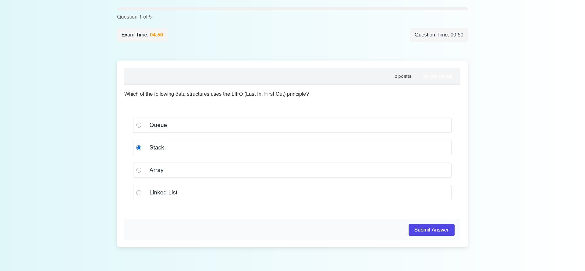
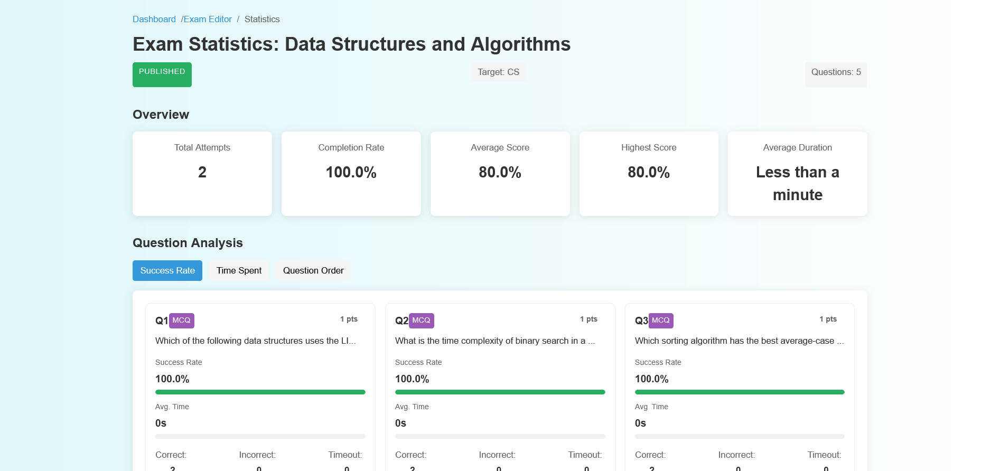

# 🎓 Exam Management System – Built with Just JavaScript

Say hello to the **Exam Management System**, a full-stack web app where teachers can create exams, share them with students, and view results in real-time.

No React. No TypeScript. No fancy frameworks. Just **pure JavaScript**, **HTML**, and **CSS**, built to challenge myself and explore the pure power of the web.

---

## 📚 Table of Contents

- [🎓 Exam Management System – Built with Just JavaScript](#-exam-management-system--built-with-just-javascript)
  - [📚 Table of Contents](#-table-of-contents)
  - [🌱 The Idea Behind It](#-the-idea-behind-it)
  - [🧠 What You Can Do](#-what-you-can-do)
    - [👩‍🏫 Teachers can:](#-teachers-can)
    - [👨‍🎓 Students can:](#-students-can)
  - [🛠️ Tech I Used](#️-tech-i-used)
  - [📸 Quick Look](#-quick-look)
  - [💡 What I Learned](#-what-i-learned)
  - [📜 License](#-license)
  - [📬 Contact](#-contact)

---

## 🌱 The Idea Behind It

As a frontend developer, I usually rely on modern tools like React or TypeScript. But for this project, I wanted to go back to basics.

So I set a challenge: **Build a real app with no frameworks**. Just pure code.

The goal? To sharpen my problem-solving skills, master the DOM, and better understand how everything works under the hood.

---

## 🧠 What You Can Do

### 👩‍🏫 Teachers can:

- Create and manage exams easily.
- Add multiple-choice or direct-answer questions.
- Share exams using a simple link.
- See which students completed the exam.
- Get real-time stats and performance insights.

### 👨‍🎓 Students can:

- Join exams through shared links.
- Take tests in a clean, mobile-friendly interface.
- Get instant results.
- View their completed exams.

---

## 🛠️ Tech I Used

- **Frontend**: HTML, CSS, Vanilla JavaScript
- **Backend**: Node.js, Express.js, JWT
- **Database**: MongoDB

👉 No libraries. No frameworks. Just handcrafted code.

---

## 📸 Quick Look

- 📊 Teacher Dashboard  
  

- 📝 Exam Creation Page  
  

- 📱 Student Exam Interface  
  

- 📈 Exam Statistics  
  

---

## 💡 What I Learned

- DOM manipulation, event handling, and writing modular JavaScript
- Building custom form validation, routing, and AJAX calls
- Structuring large apps without frameworks
- A deeper appreciation for modern tools, they do a lot more than we think!

---

## 📜 License

This project is licensed under the MIT License. Feel free to use and modify it for your own projects.

See [LICENSE](./LICENSE) for more information.

---

## 📬 Contact

If you have any questions, feedback, or just want to connect, feel free to reach out:

- **Email**: heynzar@gmail.com
- **GitHub**: [github.com/heynzar](https://github.com/heynzar)
- **LinkedIn**: [linkedin.com/in/heynzar](https://linkedin.com/in/heynzar)

---
